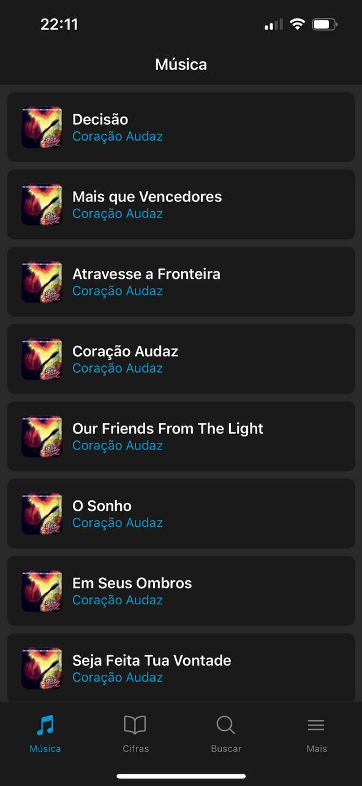
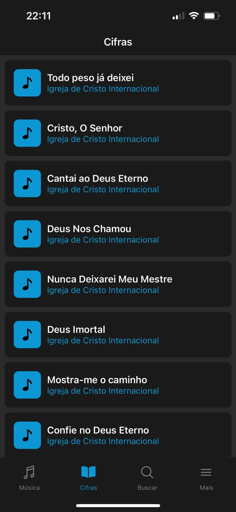
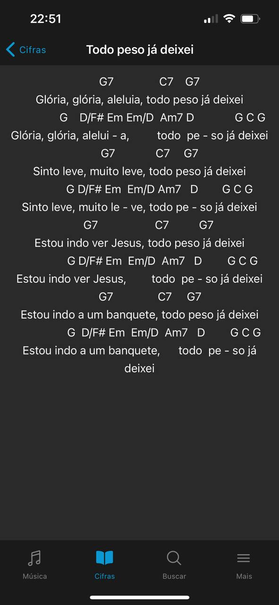
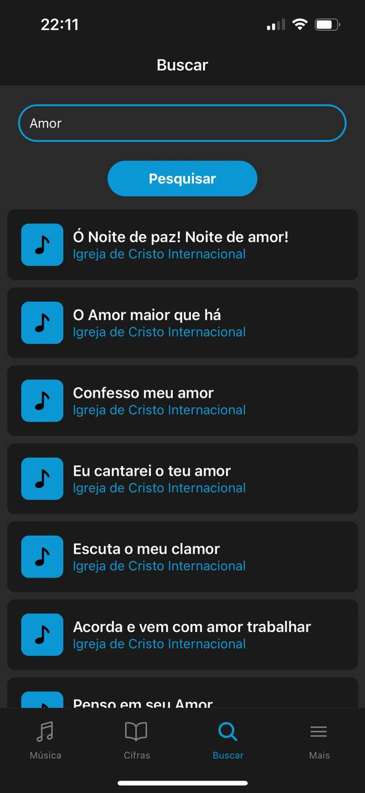
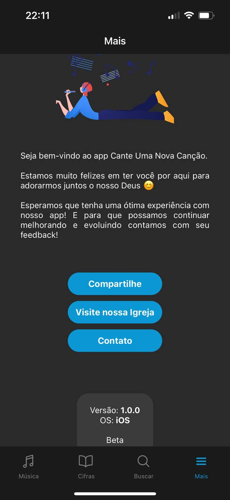

<p align="center" style="display: flex; align-items: center; justify-content: space-evenly; align-content: center; line-height: 10px;">
    
    
    
    
    
</p>

<h1 align="center">
    
    <p style="display: flex; align-items: center; justify-content: center;line-height: 22px; margin-top: 15px">
        Cante Uma Nova Canção
        
    </P>
</h1>

<p align="center">
    <a href="#computer-sobre-o-projeto">Sobre</a> &nbsp | &nbsp  
    <a href="#art-layout">Layout</a> &nbsp  | &nbsp 
    <a href="#wrench-tecnologias-utilizadas">Tecnologias utilizadas</a> &nbsp  | &nbsp 
    <a href="#pushpin-pré-requisitos">Pré-requisitos</a> &nbsp  | &nbsp 
    <a href="#zap-rodando-a-aplicação">Rodando a aplicação</a> &nbsp  | &nbsp 
    <a href="#construction_workerautor">Autor</a>
</p>

### :computer: **Sobre o projeto**

<p align="center">
    Um app de música criado com <a href="https://reactnative.dev/" target="_blank">🔗 React Native</a> para ter as músicas da Igreja de Cristo Internacional
    na palma da mão e poder acompanhar, ouvir e cantar onde estiver.
</p>

### :art: **Layout**
<br>

<p align="center">
    
    
    
    
    
    
</p>

### :wrench: **Tecnologias utilizadas**
- ``Expo``
- ``React Native``
- ``JavaScript``
- ``Node.JS``
- ``Visual Studio Code``

<h2 align="center">🚀 Como executar o projeto</h2>

### :pushpin: **Pré-requisitos**

<p>
    Antes de começar, é necessário ter algumas ferramentas instaladas no seu PC:
</p>

- [Node.JS](https://nodejs.org/en/)
- [Git](https://git-scm.com/)
- [VS Code](https://code.visualstudio.com/)
- [Expo CLI](https://docs.expo.dev/get-started/installation/)<br>

💡 (Seguir todos os passos de instalação do Expo CLI)


## :zap: **Rodando a aplicação**

```bash
  npm install 
  npm start
```
ou

```bash
  yarn
  yarn start
```
ou 

```bash
    expo start
```

## :construction_worker: **Autor**

| [<br><sub>Anthony Oliveira 🚀</sub>](https://github.com/anthonyoliver1) 
| :---: |

Feito com ❤️ por Anthony Oliveira! 
